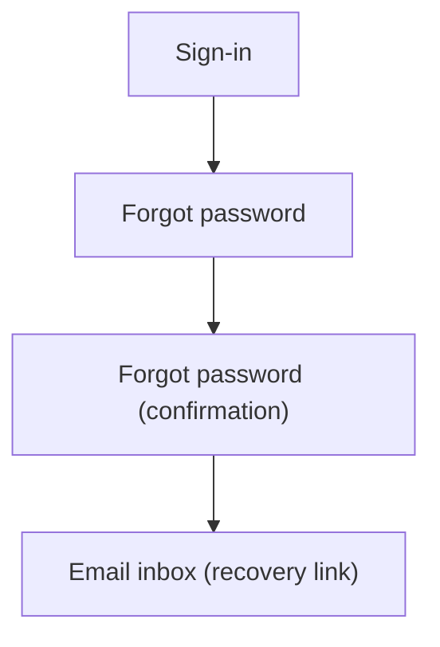

## 1. Product Overview

Enable users to recover account access via email-based password reset.
The flow must match existing Nexus UI styling and keep current login behavior unchanged.

## 2. Core Features

### 2.1 User Roles

| Role | Registration Method              | Core Permissions                                        |
| ---- | -------------------------------- | ------------------------------------------------------- |
| User | Existing registration/login flow | Can request password reset email and set a new password |

### 2.2 Feature Module

Our password recovery requirements consist of the following main pages:

1. **Sign-in**: entry point link to “Forgot password”, consistent error/success messaging.
2. **Forgot password**: email input, submit, confirmation state.
3. **Reset password**: set new password, confirm, submit, completion state.

### 2.3 Page Details

| Page Name       | Module Name            | Feature description                                                                                                            |
| --------------- | ---------------------- | ------------------------------------------------------------------------------------------------------------------------------ |
| Sign-in         | Forgot-password entry  | Show “Forgot password?” link/button that routes to Forgot password page; keep existing sign-in form and behavior unchanged.    |
| Forgot password | Email capture          | Enter email; validate format; disable submit while sending; show generic confirmation message (do not reveal if email exists). |
| Forgot password | Email delivery trigger | Send reset email containing a single-use recovery link back to the app (with required token parameters).                       |
| Forgot password | Support states         | Show resend action (rate-limited) and clear error state for network failures.                                                  |
| Reset password  | Token handling         | Read token params from URL; validate presence/format; show expired/invalid token message with link back to Forgot password.    |
| Reset password  | New password form      | Enter new password + confirm; enforce basic password rules; show strength/help text; submit to update password.                |
| Reset password  | Completion             | Show success confirmation and CTA to return to Sign-in.                                                                        |

## 3. Core Process

**User Flow**

1. From Sign-in, you click “Forgot password?”.
2. You enter your email and submit; the app shows a generic “If an account exists…” confirmation.
3. You receive an email with a recovery link; you click it to open the Reset password page.
4. You set a new password and submit.
5. You see confirmation and return to Sign-in to log in with the new password.

