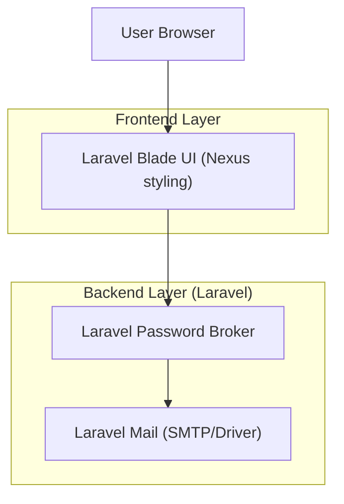

## 1.Architecture design

## 2.Technology Description
- Frontend: Laravel Blade views using your existing Nexus styling system
- Backend: Laravel Password Broker + Laravel Mail (SMTP/driver-based email delivery)

## 3.Route definitions
| Route | Purpose |
|-------|---------|
| /login | Existing sign-in page; add link to /forgot-password without changing current auth behavior |
| /forgot-password | Request a password reset email; always show generic confirmation |
| /reset-password | Accept recovery token params; allow setting a new password |

## 4.API definitions (If it includes backend services)
None (uses Laravel built-in password reset endpoints).

## 6.Data model(if applicable)
Uses Laravel password reset tokens storage (database table) and existing users table.

### Implementation notes (compatibility + styling)
- Backward compatibility:
  - Do not change the existing login route, form fields, or existing auth provider wiring.
  - Add new routes and UI as additive changes only.
  - Token handling uses Laravel’s `password.reset` token format and should fail gracefully on invalid/expired tokens.
- Email delivery:
  - Use Laravel Mail with your configured SMTP/driver; reset link routes back to `/reset-password/{token}`.
  - Ensure the Reset page handles invalid/expired tokens gracefully and guides back to Forgot password.
- Security:
  - On Forgot password, never reveal whether the email exists.
  - Rate-limit resend on the client (cooldown UI) and rely on provider limits server-side.
  - Enforce minimum password rules client-side; rely on auth provider enforcement server-side.
- Nexus styling:
  - Reuse the existing layout shell, typography scale, inputs/buttons, and alert/toast patterns.
  - Match spacing and card widths used by current auth screens (desktop-first, centered panel).
